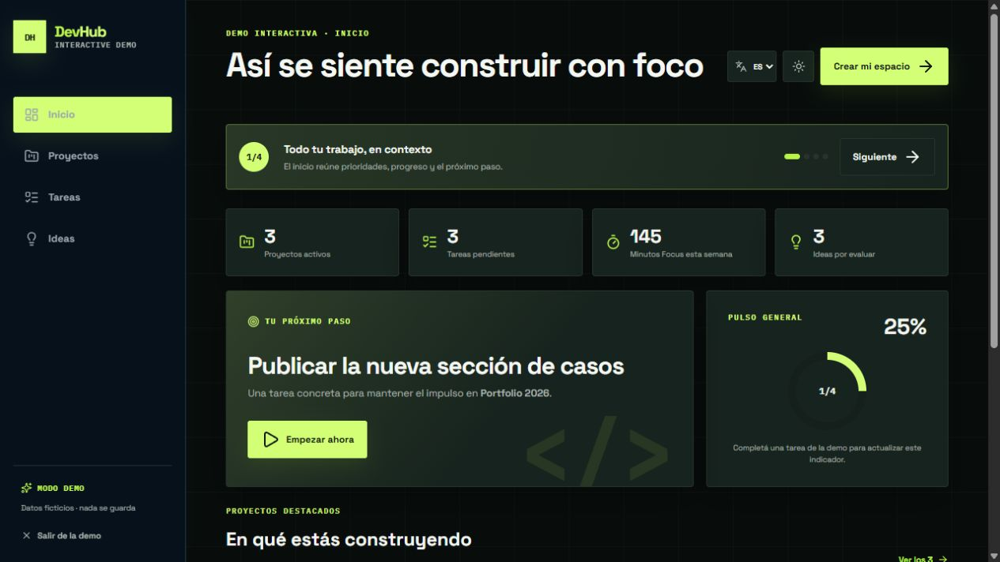
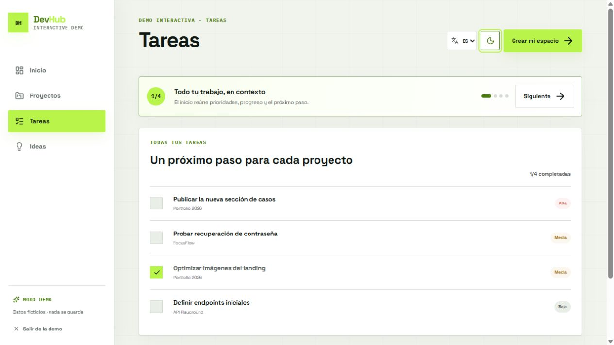
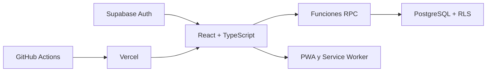

<p align="center">
  
</p>

<h1 align="center">DevHub</h1>

<p align="center">
  Un sistema de trabajo para transformar ideas en proyectos terminados.
</p>

<p align="center">
  <a href="https://dev-project-hub.vercel.app/demo"><strong>Ver demo interactiva</strong></a>
  ·
  <a href="https://dev-project-hub.vercel.app/login">Abrir DevHub</a>
</p>

<p align="center">
  <a href="https://github.com/JuanIgCuevas/dev-project-hub/actions/workflows/quality.yml"></a>
  
  
  
</p>

DevHub ayuda a desarrolladores independientes a organizar proyectos, elegir el
próximo paso, trabajar con foco y convertir el proceso en una historia que se
pueda compartir. Combina gestión, memoria de trabajo y presentación pública en
una única experiencia responsive, bilingüe e instalable.

> La [demo interactiva](https://dev-project-hub.vercel.app/demo) no requiere una
> cuenta y utiliza datos ficticios que no se guardan. El enlace quedará activo
> en producción al integrar `Development` en `main`.

## El problema

Los proyectos personales suelen quedar repartidos entre listas, notas y
repositorios. El resultado es mucha información, pero poca claridad sobre qué
hacer a continuación. DevHub reúne ese contexto y lo convierte en acciones:

- prioriza el siguiente paso;
- muestra la salud y el progreso de cada proyecto;
- conserva decisiones, avances y sesiones Focus;
- transforma proyectos terminados en páginas públicas compartibles.

## Recorrido visual

### Un inicio centrado en avanzar



El resumen combina proyectos activos, trabajo pendiente, tiempo enfocado y una
recomendación concreta para continuar.

### Tareas claras en ambos temas



La demo permite recorrer proyectos, completar tareas y explorar ideas sin
registrarse. También incluye tema claro/oscuro e interfaz en español e inglés.

## Funcionalidades

| Área | Capacidades |
| --- | --- |
| Proyectos | Estados, tecnologías, enlaces, tareas, progreso y Project Pulse |
| Foco | Temporizador, objetivo diario, historial, resultados y próximo paso |
| Memoria | Diario de desarrollo, decisiones técnicas y recuperación de contexto |
| Ideas | Captura, evaluación y conversión en proyecto |
| Presentación | Demo sin registro y páginas públicas por proyecto |
| Personalización | Español/inglés, tema claro/oscuro y preferencias del espacio |
| Plataforma | PWA instalable, responsive, estados offline y actualizaciones |
| Cuenta | Autenticación, exportación, sesiones y eliminación de datos |

## Arquitectura



El navegador no accede directamente a las tablas de negocio. Las operaciones
se realizan mediante funciones SQL y las políticas RLS mantienen los datos
aislados por usuario. Supabase Auth administra identidad y sesiones.

## Stack

- React 19, TypeScript y Vite.
- React Router, TanStack Query y React Hook Form.
- Zod para validación de formularios.
- Supabase Auth, PostgreSQL, RPC y Row Level Security.
- Vitest, Testing Library y axe-core para controles de accesibilidad.
- GitHub Actions, Dependabot y Vercel.

## Puesta en marcha

Necesitás Node.js 22 y un proyecto de Supabase.

```bash
git clone https://github.com/JuanIgCuevas/dev-project-hub.git
cd dev-project-hub
npm install
```

1. Copiá `.env.example` como `.env`.
2. Completá la URL y la clave pública de Supabase.
3. Aplicá, en orden, las migraciones de `supabase/migrations`.
4. Iniciá la aplicación:

```bash
npm run dev
```

Para probar la versión instalable y la demo como se verán en producción:

```bash
npm run build
npm run preview
```

## Calidad y seguridad

```bash
npm run check
```

Este comando ejecuta ESLint, las pruebas funcionales y de accesibilidad, y la compilación de
producción. GitHub Actions repite el control en pushes y pull requests hacia
`Development` y `main`, y también audita las dependencias de producción.

Vercel agrega Content Security Policy, protección contra iframes, restricciones
de permisos y HTTPS estricto. Los enlaces externos se limitan a `http` y
`https`. Consulta [SECURITY.md](./SECURITY.md) para reportar una vulnerabilidad
de forma privada.

> Las claves privadas nunca deben utilizar prefijos `VITE_` o `NEXT_PUBLIC_`:
> esos valores forman parte del código que recibe el navegador.

## Flujo de trabajo

- `Development`: integración y previews de revisión.
- `main`: versión estable publicada en producción.
- Dependabot propone actualizaciones en `Development`.
- Vercel genera previews por rama y publica `main`.

## Material de presentación

- [Guion de demo de 3 minutos](./docs/DEMO_GUIDE.md)
- [Caso de estudio para portfolio](./docs/CASE_STUDY.md)
- [Ver video corto de producto](https://dev-project-hub.vercel.app/video/devhub-product-demo-50s.mp4)
- [Archivos de producción del video](./docs/video/README.md)
- [Lista de control para publicar](./docs/RELEASE_CHECKLIST.md)
- [Política de seguridad](./SECURITY.md)
